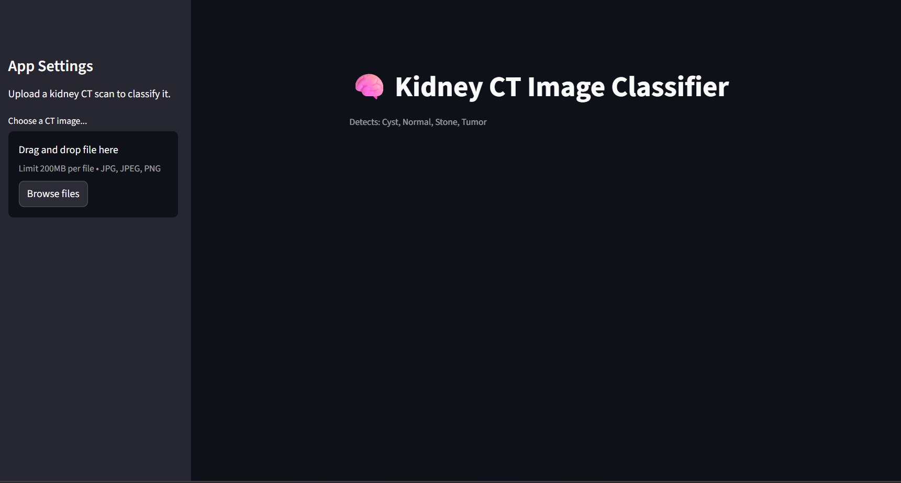
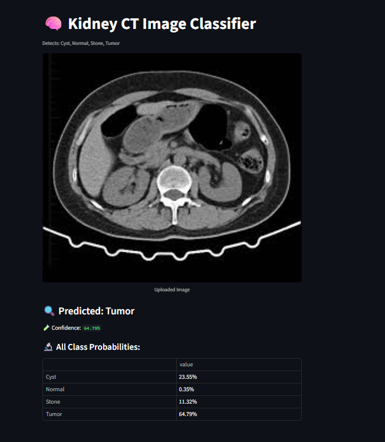

<div align="center">

# 🩺 Kidney CT Scan Disease Classifier



**A deep learning-powered web application for classifying kidney CT scan images into four medical categories using a custom CNN model.**

[](https://python.org)
[](https://tensorflow.org)
[](https://streamlit.io)
[](#-training-results)

</div>

---

## 📸 Application Preview



---

## 📊 Dataset

| Class     | Images     | Train     | Test      |
| --------- | ---------- | --------- | --------- |
| 🔵 Cyst   | 3,709      | 2,967     | 742       |
| 🟢 Normal | 5,077      | 4,061     | 1,016     |
| 🟡 Stone  | 1,377      | 1,101     | 276       |
| 🔴 Tumor  | 2,283      | 1,826     | 457       |
| **Total** | **12,446** | **9,955** | **2,491** |

**Source:** [Kaggle — CT Kidney Dataset](https://www.kaggle.com/datasets/nazmul0087/ct-kidney-dataset-normal-cyst-tumor-and-stone)

---

## ⚙️ Features

- 🔬 **4-Class Detection** — Classifies CT scans as Cyst, Normal, Stone, or Tumor
- 📈 **Confidence Scores** — Displays prediction probability for each class
- ⚡ **Real-time Inference** — Fast predictions using a pre-trained CNN model
- 🖼️ **Image Preview** — Uploads and renders the CT scan in the UI
- 🌙 **Dark Theme UI** — Clean, user-friendly Streamlit interface

---

## 🧠 Model Architecture & Training

### 🔧 Architecture — Custom CNN (Sequential)

The model was built from scratch using **TensorFlow/Keras** and trained on **Google Colab (T4 GPU)**.

```
Input: 150×150×3 RGB Images
─────────────────────────────────────────────────────────────
Layer                     Output Shape          Parameters
─────────────────────────────────────────────────────────────
Conv2D (32 filters, 3×3)  (None, 148, 148, 32)  896
MaxPooling2D (2×2)        (None, 74,  74,  32)  0
Conv2D (64 filters, 3×3)  (None, 72,  72,  64)  18,496
MaxPooling2D (2×2)        (None, 36,  36,  64)  0
Conv2D (128 filters, 3×3) (None, 34,  34,  128) 73,856
MaxPooling2D (2×2)        (None, 17,  17,  128) 0
Flatten                   (None, 36992)         0
Dense (128 units, ReLU)   (None, 128)           4,735,104
Dropout (0.5)             (None, 128)           0
Dense (4 units, Softmax)  (None, 4)             516
─────────────────────────────────────────────────────────────
Total Trainable Params: 4,828,868 (~18.42 MB)
```

### 🗂️ Data Preparation (`dataSplit.ipynb`)

- The raw dataset was split using an **80/20 ratio** with `random.shuffle` to ensure unbiased distribution
- Each class was independently shuffled and split into `train/` and `test/` subdirectories
- Used Python's `shutil.copy` to replicate images without modifying the original dataset

### �️ Training Pipeline (`modelTraining.ipynb`)

| Step                    | Detail                                                                     |
| ----------------------- | -------------------------------------------------------------------------- |
| **Framework**           | TensorFlow / Keras (Sequential API)                                        |
| **Platform**            | Google Colab with T4 GPU Accelerator                                       |
| **Image Size**          | 150 × 150 pixels (RGB)                                                     |
| **Batch Size**          | 32                                                                         |
| **Epochs**              | 10                                                                         |
| **Optimizer**           | Adam (default learning rate)                                               |
| **Loss Function**       | Categorical Crossentropy                                                   |
| **Data Normalization**  | Rescale pixel values to `[0, 1]` via `1./255`                              |
| **Data Loading**        | `ImageDataGenerator.flow_from_directory()` with `class_mode='categorical'` |
| **Regularization**      | Dropout (rate = 0.5) on the Dense layer                                    |
| **Activation (Hidden)** | ReLU                                                                       |
| **Activation (Output)** | Softmax (4 classes)                                                        |

### 📈 Training Results

| Epoch | Train Accuracy | Val Accuracy | Train Loss | Val Loss |
| ----- | -------------- | ------------ | ---------- | -------- |
| 1     | 74.19%         | 99.68%       | 0.6578     | 0.0128   |
| 2     | 98.34%         | 99.88%       | 0.0521     | 0.0061   |
| 5     | 99.66%         | 99.96%       | 0.0095     | 0.0005   |
| 8     | 99.37%         | **100.00%**  | 0.0180     | 0.00005  |
| 10    | **99.78%**     | **100.00%**  | 0.0081     | 0.00003  |

> 🏆 **Final Test Accuracy: 100%** — Evaluated on 2,491 unseen CT images across 4 classes
>
> 💾 The trained model was exported as `kidney_classifier_model.h5` (HDF5 format, ~55 MB)

---

## � Tech Stack

| Tool                   | Purpose                              |
| ---------------------- | ------------------------------------ |
| **Python 3.10+**       | Core language                        |
| **TensorFlow / Keras** | Model building, training & inference |
| **Streamlit**          | Web application interface            |
| **PIL / Pillow**       | Image processing & resizing          |
| **NumPy**              | Numerical computation                |
| **Matplotlib**         | Training curve visualization         |
| **Google Colab**       | Cloud GPU training environment       |

---

## 🚀 How to Run

```bash
# 1. Clone the repository
git clone https://github.com/your-username/Kidney-disease-detection
cd Kidney-disease-detection

# 2. Create & activate a virtual environment (recommended)
# Windows
python -m venv venv
venv\Scripts\activate

# Mac / Linux
python3 -m venv venv
source venv/bin/activate

# 3. Install dependencies
pip install streamlit tensorflow pillow numpy

# 4. Launch the application
streamlit run app.py
```

---

## 📁 Project Structure

```
Kidney-disease-detection/
├── app.py                        # Streamlit web application
├── kidney_classifier_model.h5    # Pre-trained CNN model (~55 MB)
├── dataSplit.ipynb               # Dataset split (80/20) pipeline
├── modelTraining.ipynb           # CNN training pipeline (Colab)
├── hero.png                      # App banner / hero image
├── test.png                      # App screenshot
├── dataset/                      # Split CT scan dataset
│   ├── train/                    # 9,955 training images
│   │   ├── Cyst/
│   │   ├── Normal/
│   │   ├── Stone/
│   │   └── Tumor/
│   └── test/                     # 2,491 test images
│       ├── Cyst/
│       ├── Normal/
│       ├── Stone/
│       └── Tumor/
└── README.md
```

---

## 🎯 Usage

1. **Launch the app** → Run `streamlit run app.py`
2. **Upload a scan** → Use the sidebar to upload a kidney CT scan (`.jpg`, `.jpeg`, `.png`)
3. **View prediction** → See the predicted class, confidence score, and probability breakdown for all 4 classes
4. **Interpret results** → Green bar highlights the top prediction; all class probabilities are displayed

---

## ⚠️ Medical Disclaimer

> This tool is intended for **research and educational purposes only**.
>
> It is **not a certified medical device** and must **not** be used as a substitute for professional medical diagnosis.
> Always consult a qualified healthcare provider for medical decisions.

---

<div align="center">

Made with ❤️ using TensorFlow & Streamlit

</div>
